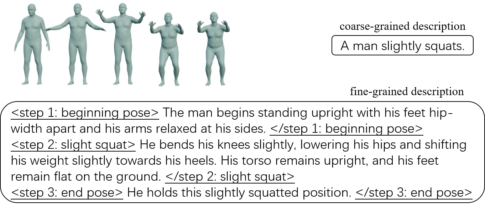

## <p align="center">Motion Generation from Fine-grained Textual Descriptions<br><br> LREC-COLING 2024 </p>
<div align="center">
  <a href="https://kunhangl.github.io/" target="_blank">Kunhang&nbsp;Li</a> &emsp; 
  <a href="https://sites.google.com/site/ysfeng/home" target="_blank">Yansong&nbsp;Feng</a> &emsp;
  <br> <br>
  <a href="http://arxiv.org/abs/2403.13518" target="_blank">Paper</a> &emsp;
  <a href="https://kunhangl.github.io/finemotiondiffuse/" target="_blank">Project&nbsp;Page</a>
</div>

<br>

<p align="center">
    
</p>

## FineHumanML3D Textual Data
The zip file `./shared_data/fine-grained_texts.zip` ([link](https://github.com/KunhangL/finemotiondiffuse/tree/main/shared_data)) stores **FineHumanML3D** textual descriptions generated from <a href="https://github.com/EricGuo5513/HumanML3D">HumanML3D</a> with our prompt on GPT-3.5-turbo-0301. Due to copyright issues, please follow the instructions of HumanML3D to prepare motion data by yourself.<br>

The data entries look like below. Each `.txt` file corresponds to one HumanML3D motion file with the same name. There are usually multiple descriptions in one `.txt` file, and each one of them describes the same motion from different aspects.
```
./texts_all_code_v2_marked_texts_tagged
├── 000000.txt
├── 000001.txt
├── 000002.txt
├── 000003.txt
├── ...
├── M000000.txt
├── M000001.txt
├── M000002.txt
├── M000003.txt
├── ...
```
### !!! NOTE !!! ###
When you use these fine-grained descriptions, please bear in mind that our fine-grained texts do not correspond to all the coarse-grained descriptions in HumanML3D, for we deleted some texts due to problematic responses from GPT-3.5-turbo-0301. In such situations, we simply leave the corresponding lines in the `.txt` files blank.<br>

For example, while the original `010146.txt` in HumanML3D has two coarse-grained descriptions in two lines, the `010146.txt` in FineHumanML3D also has two lines, but the first line is left blank because GPT-3.5-turbo-0301 did not return valid responses, resulting in only one fine-grained description for this motion.

## Citation
If you are using the FineHumanML3D dataset, please consider citing both our paper and the HumanML3D paper:
```
@inproceedings{li-feng-2024-motion-generation,
    title = "Motion Generation from Fine-grained Textual Descriptions",
    author = "Li, Kunhang and Feng, Yansong",
    booktitle = "Proceedings of the 2024 Joint International Conference on Computational Linguistics, Language Resources and Evaluation (LREC-COLING 2024)",
    month = may,
    year = "2024",
    address = "Torino, Italy",
    publisher = "ELRA and ICCL",
    url = "https://aclanthology.org/2024.lrec-main.1016",
    pages = "11625--11641"
}
```
```
@InProceedings{Guo_2022_CVPR,
    author    = {Guo, Chuan and Zou, Shihao and Zuo, Xinxin and Wang, Sen and Ji, Wei and Li, Xingyu and Cheng, Li},
    title     = {Generating Diverse and Natural 3D Human Motions From Text},
    booktitle = {Proceedings of the IEEE/CVF Conference on Computer Vision and Pattern Recognition (CVPR)},
    month     = {June},
    year      = {2022},
    pages     = {5152-5161}
}
```